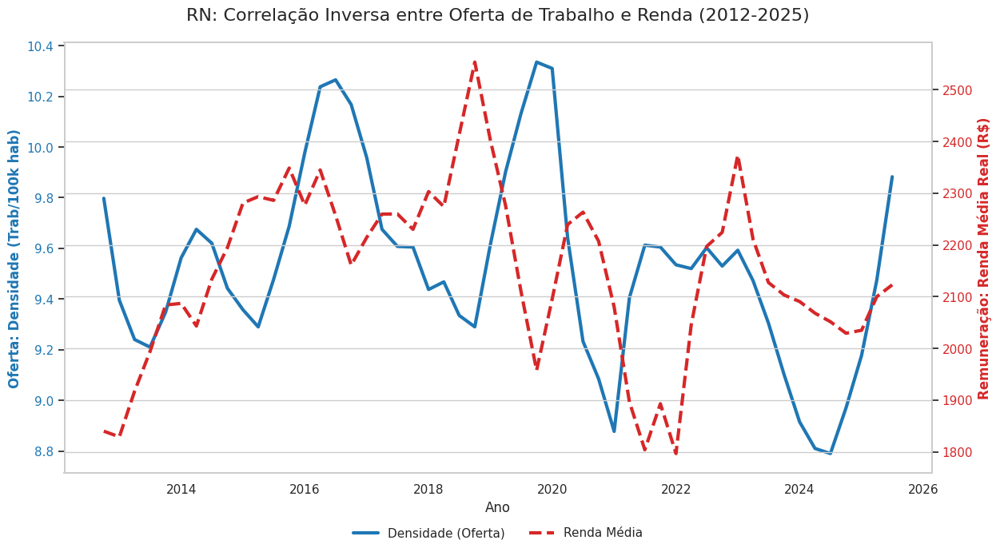
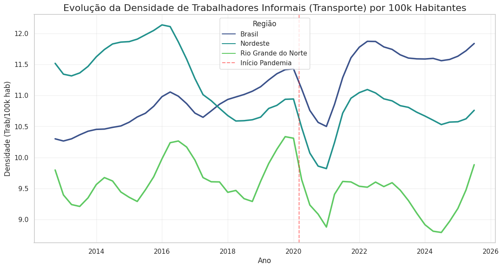

#  O Paradoxo da Uberização: Análise de Dados (Brasil vs. RN)

> Uma investigação quantitativa sobre a precarização do trabalho, saturação de mercado e desigualdades regionais no setor de transporte informal (2012-2025).

##  Sobre o Projeto
Este projeto de Ciência de Dados analisa o fenômeno da "uberização" (crescimento do trabalho por conta própria no transporte) através de uma abordagem comparativa entre o cenário macro (Brasil) e micro (Rio Grande do Norte).

Utilizando dados secundários da PNAD Contínua (IBGE) e técnicas de imputação estatística, o estudo investiga a correlação entre a **oferta de mão de obra** (densidade de motoristas) e a **qualidade da remuneração** (renda média real).

##  Principais Insights

| Correlação - Oferta de Trabalho e Renda | Evolução - Densidade de Trabalhadores Informais (Transporte) / 100k Habitantes |
| :---: | :---: |
|  |  |

A análise revelou divergências estruturais importantes:

1.  **Cenário Nacional (Saturação):** O Brasil apresentou um aumento de **19% na densidade** de trabalhadores informais, acompanhado de estagnação da renda. Isso valida a hipótese de precarização por excesso de oferta.
2.  **Cenário Regional (Ajuste):** O Rio Grande do Norte foi na contramão, com redução na oferta de motoristas, o que gerou uma **valorização real de 10,3% na renda** média em 12 anos.
3.  **Desigualdade Estrutural:** Apesar da recuperação, a renda média de um motorista no RN (R$ 2.029) ainda é **37% menor** que a média nacional (R$ 3.230), evidenciando o abismo econômico regional.

##  Tecnologias e Metodologia
O pipeline de dados foi construído em **Python** (Jupyter Notebook), cobrindo:

* **Engenharia de Dados (ETL):**
    * Consolidação de 9 bases de dados dispersas (IBGE/Sidra).
    * Tratamento de *Missing Values* via **Interpolação Linear** (preservação de tendências temporais).
    * Enriquecimento com dados demográficos (projeção intercensitária 2010-2022).
* **Análise Exploratória (EDA):**
    * Visualização de tendências com Média Móvel (*Rolling Average*).
    * Gráficos de Eixo Duplo para correlação (Oferta x Renda).
    * Matriz de Variação Percentual (Cenários).

##  Limitações e Soberania de Dados
Uma das principais barreiras encontradas foi a **ausência de dados primários** das plataformas (Big Techs). A análise dependeu de *proxies* oficiais (categoria "Conta Própria").

**Recomendação Estratégica:** O estudo aponta para a necessidade de **Plataformas Públicas de Mobilidade**. Além de reduzir taxas para o trabalhador, tais plataformas garantiriam a soberania dos dados, permitindo à gestão pública desenhar políticas baseadas em evidências reais, e não apenas em estimativas.

##  Estrutura do Repositório
* `notebooks/`: Código completo da ETL e Análise.
* `data/raw/`: Datasets brutos.
* `data/processed/`: Dataset tratado (`dataset_uberizacao_tratado_final.csv`).
* `img/`: Gráficos gerados durante o estudo.

---
**Autor:** [Jadson Chagas](https://www.linkedin.com/in/jadson-chagas/)
*Data Scientist & Pesquisador*
[Acesse meu perfil no Kaggle](https://www.kaggle.com/jadsonchagas)
